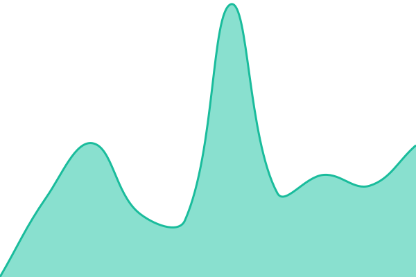
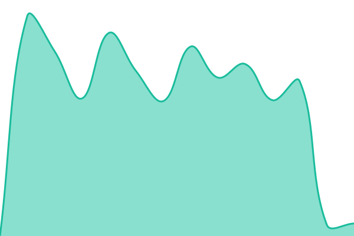
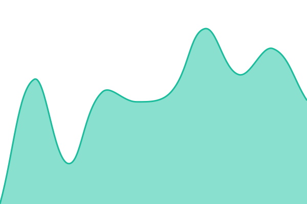
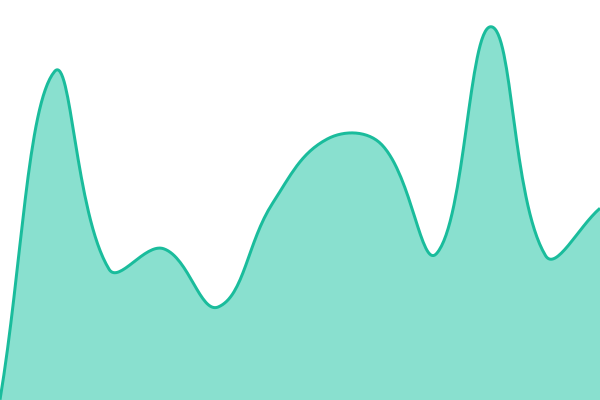
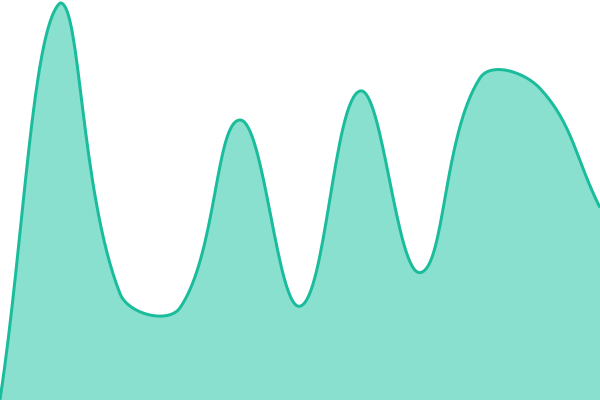

# [📈 Live Status](https://uptime.vector.co.uz): <!--live status--> **🟩 All systems operational**

This repository contains the open-source uptime monitor and status page for [Vector](https://links.vector.co.uz/), powered by [Upptime](https://github.com/upptime/upptime).

With [Upptime](https://upptime.js.org), you can get your own unlimited and free uptime monitor and status page, powered entirely by a GitHub repository. We use [Issues](https://github.com/vector-co-uz/uptime/issues) as incident reports, [Actions](https://github.com/vector-co-uz/uptime/actions) as uptime monitors, and [Pages](https://uptime.vector.co.uz) for the status page.

<!--start: status pages-->
<!-- This summary is generated by Upptime (https://github.com/upptime/upptime) -->
<!-- Do not edit this manually, your changes will be overwritten -->
<!-- prettier-ignore -->
| URL | Status | History | Response Time | Uptime |
| --- | ------ | ------- | ------------- | ------ |
|  [Homeassistant](https://ha.vector.co.uz) | 🟩 Up | [homeassistant.yml](https://github.com/vector-co-uz/upptime/commits/HEAD/history/homeassistant.yml) | 

 1247ms
     
 | 

<a href="https://uptime.vector.co.uz/history/homeassistant">100.00%</a>
    

|  [Frigate](https://frigate.vector.co.uz) | 🟩 Up | [frigate.yml](https://github.com/vector-co-uz/upptime/commits/HEAD/history/frigate.yml) | 

 1181ms
     
 | 

<a href="https://uptime.vector.co.uz/history/frigate">100.00%</a>
    

|  [Links](https://links.vector.co.uz) | 🟩 Up | [links.yml](https://github.com/vector-co-uz/upptime/commits/HEAD/history/links.yml) | 

 653ms
     
 | 

<a href="https://uptime.vector.co.uz/history/links">100.00%</a>
    

|  [Gotify](https://gtfy.vector.co.uz) | 🟩 Up | [gotify.yml](https://github.com/vector-co-uz/upptime/commits/HEAD/history/gotify.yml) | 

 774ms
     
 | 

<a href="https://uptime.vector.co.uz/history/gotify">100.00%</a>
    

|  [Jellyfin](https://fin.vector.co.uz) | 🟩 Up | [jellyfin.yml](https://github.com/vector-co-uz/upptime/commits/HEAD/history/jellyfin.yml) | 

 1065ms
     
 | 

<a href="https://uptime.vector.co.uz/history/jellyfin">9.36%</a>
    

<!--end: status pages-->

[**Visit our status website →**](https://uptime.vector.co.uz)

## 📄 License

- Powered by: [Upptime](https://github.com/upptime/upptime)
- Code: [MIT](./LICENSE) © [Anand Chowdhary](https://anandchowdhary.com)
- Data in the `./history` directory: [Open Database License](https://opendatacommons.org/licenses/odbl/1-0/)
